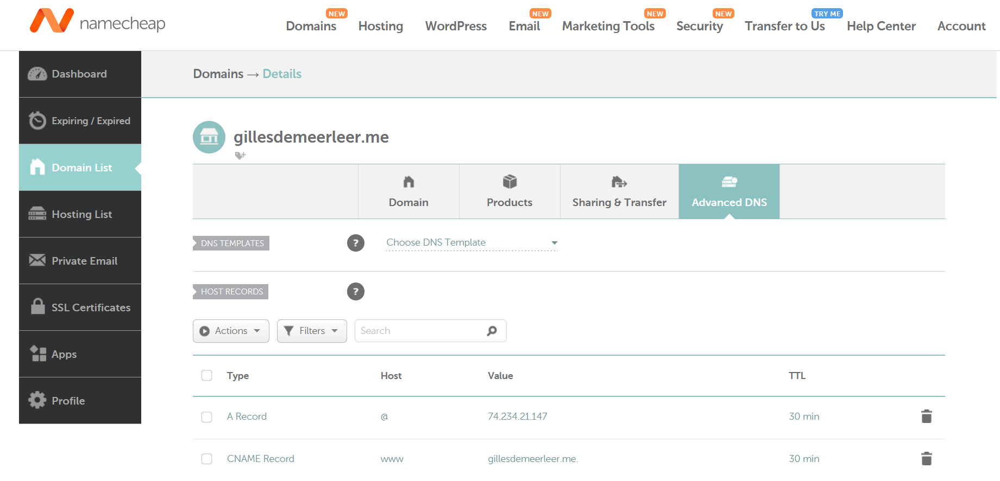
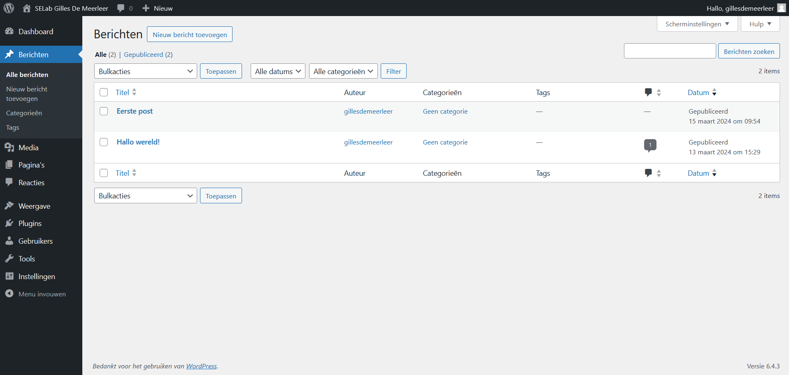

# Verslag: Wordpress opzetten in MS Aure

> Naam verslaggever: Zander Van Kerckhove

## Beschrijving

Het doel van deze opdracht was het opzetten van een webserver en een databankserver in de Microsoft Azure Cloud-omgeving. Het voordeel hiervan is dat we ons geen zorgen hoeven te maken over de hardware, aangezien Microsoft deze verantwoordelijkheid uit onze handen neemt. Als studenten kunnen we jaarlijks gebruikmaken van een $100 gratis Azure-budget. Op de webserver draaiden we WordPress, een veelgebruikt en open-source Content Management System (CMS) dat gebruik maakt van PHP en MySQL.

## Antwoorden op de vragen in de opdracht

### Vraag 1 - Wat is het verschil tussen de map /etc/apache2/sites-available en /etc/apache2/sites-enabled?

**/etc/apache2/sites-available:**
Hierin bevinden zich de configuratiebestanden voor de sites die beschikbaar zijn voor Apache maar echter nog niet geactiveerd. Dit betekent dus dat de sites die tot de configuratiebestanden behoren nog niet toegankelijk zijn tenzij het corresponderende configuratiebestand expliciet geactiveerd worden

**/etc/apache2/sites-enabled:** Hier worden de geactiveerde sites geplaatst. Sites die in deze map staan, zijn zowel beschikbaar als toegankelijk voor gebruikers, omdat Apache hun configuratie gebruikt om de websites te bedienen.

## Extra's

### Wordpress thema

Een thema installeren is eigenlijk vrij eenvoudig je navigeert via het linker keuzemenu naar het tabblad weergave dan kies je voor het submenu thema's.
Je komt terecht in een gallerij waar honderden wordpress themas staan. Je kies voor het thema dat je het mooist vind en klikt op installeren en nadien op activeren.

### Custom domain

Via namecheap kunnen we als student een jaar lang een gratis .me domein krijgen. Dit domein is erg makkelijk aan onze website te linken door gewoon het publiek IP van de Azure server in de DNS zone van het domein te plakken onder een A record.



We vragen ook nog een SSL certificaat aan voor dit domein.

## Evaluatiecriteria

- [x] Je kan de aangemaakte machines tonen in de Azure omgeving.
- [x] Het lukt om een SSH-verbinding op te zetten met de applicatieserver.
- [x] Het lukt om aan te melden op MySQL op de databankserver vanaf de applicatieserver.
- [x] Je kan met HTTPS surfen naar jouw WordPress blog.
- [x] Je kan kan aanmelden en het WordPress dashboard tonen.
- [x] Je kan een nieuw bericht posten op jouw WordPress blog.
- [x] Je hebt een verslag gemaakt op basis van het template.
- [x] De cheat sheet werd aangevuld met nuttige commando's die je wenst te onthouden voor later.

## Problemen en oplossingen

### Probleem 1 - Korte beschrijving van het probleem

Encryptie met certbot op DNS server wilt niet werken geeft steeds failures.

```
wordpressapp@ta-wordpressapp:~$ sudo certbot --apache
Saving debug log to /var/log/letsencrypt/letsencrypt.log
Please enter the domain name(s) you would like on your certificate (comma and/or
space separated) (Enter 'c' to cancel): ta-wordpressd-ruben.mysql.database.azure.com
Requesting a certificate for ta-wordpressd-ruben.mysql.database.azure.com

Certbot failed to authenticate some domains (authenticator: apache). The Certificate Authority reported these problems:
Domain: ta-wordpressd-ruben.mysql.database.azure.com
Type: connection
Detail: 98.64.171.176: Fetching http://ta-wordpressd-ruben.mysql.database.azure.com/.well-known/acme-challenge/PGT7mrM09EWicO7gk234_8OTiC9sjfpFH1XAhtKiZyQ: Timeout during connect (likely firewall problem)

Hint: The Certificate Authority failed to verify the temporary Apache configuration changes made by Certbot. Ensure that the listed domains point to this Apache server and that it is accessible from the internet.

Some challenges have failed.
Ask for help or search for solutions at https://community.letsencrypt.org. See the logfile /var/log/letsencrypt/letsencrypt.log or re-run Certbot with -v for more details.
```

## Voorbereiding demo

- Je kan de aangemaakte machines tonen in de Azure omgeving.
- Azure dashboard openen en machines tonen.
- Het lukt om een SSH-verbinding op te zetten met de applicatieserver.

```shell
ssh wordpressapp@zvk-wordpressapp.northeurope.cloudapp.azure.com
```

- Het lukt om aan te melden op MySQL op de databankserver vanaf de applicatieserver.

```shell
mysql -u wordpressdb -p -h zvk-wordpressdb.mysql.database.azure.com
```

- Je kan met HTTPS surfen naar jouw WordPress blog.
  https://gdm-wordpressapp.northeurope.cloudapp.azure.com/
- Je kan kan aanmelden en het WordPress dashboard tonen.
  https://gdm-wordpressapp.northeurope.cloudapp.azure.com/wp-admin
- Je kan een nieuw bericht posten op jouw WordPress blog.
  Bericht maken in admin panel van wordpress via berichten zone.
  

## Reflecties

Het opzetten van de virtuele machines in Microsoft Azure verliep over het algemeen soepel. Het Azure-portaal heeft een gebruiksvriendelijke interface waardoor dit allemaal vlot en eenvoudig verliep.

Het installeren en configureren van WordPress ging ook vrij vlot, dankzij de duidelijke documentatie en de gebruikersvriendelijke interface van WordPress zelf.

Enkel bij het aanvragen van het SSL certificaat van Let's Encrypt ondervonden sommige groepsleden moeilijkheden, maar later bleek dit te liggen aan het domein waarop ze het probeerden aan te vragen. Dit was het domein van de databankserver en niet dat van de applicatieserver.

## Bronnen

Heidi, E. (2020, 29 april). How To Secure Apache with Let's Encrypt on Ubuntu 20.04. https://www.digitalocean.com/community/tutorials/how-to-secure-apache-with-let-s-encrypt-on-ubuntu-20-04

Install and configure WordPress | Ubuntu. (z.d.). Ubuntu. https://ubuntu.com/tutorials/install-and-configure-wordpress#1-overview
