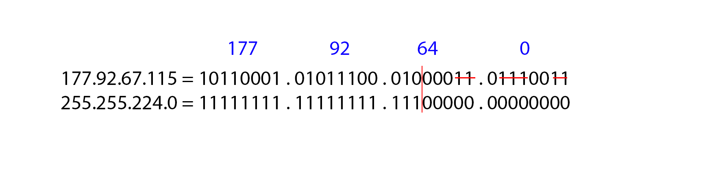
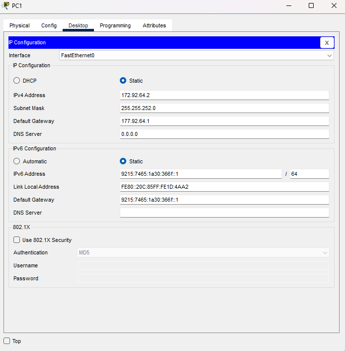

# Verslag: Netwerk in packet tracer

> Naam verslaggever: Gilles De Meerleer

## Beschrijving

De bedoeling van deze opdracht was om een simulatienetwerk uit te werken in Cisco packet tracer met alles erop en eraan. We moesten een adresseringsschema opstellen voor zowel IPv4 als IPv6 en dit netwerk vervolgens configureren. We moesten ook de routers en switches configureren en ervoor zorgen dat de werkstations konden communiceren met elkaar. We moesten ook de routers en switches beveiligen en SSH inschakelen. Tot slot moesten we ook de connectiviteit testen en de volledige werking hiervan bespreken in het verslag.

## Antwoorden op de vragen in de opdracht

### Vraag 1 - Genereer een random IPv4 adress en een prefixlengte

Het IP-adres dat ik gegenereerd heb is: 177.92.67.115
De prefixlengte is 19.

### Vraag 2 - Verdeel het netwerk in 4 subnetten van gelijke grootte

Om het netwerkadres te vinden behouden we de bits waarbij de waarde van de bit in het subnetmasker 1 is. Hiermee stellen we het netwerkadres op.

Met het bekomen netwerkadres kunnen we dan de subnetten opstellen. Aangezien we een prefix hebben van 19 ziet ons subnetmasker er als volgt uit:
11111111.11111111.11100000.00000000 (De eerste 19 bits zijn enen)
Omdat we ons netwerk willen onderverdelen in 4 subnetten voegen we 2 bits toe want 2² = 4.
11111111.11111111.111**11**000.00000000 = 255.255.248.0
Ons netwerk adres is dan:
In dit geval hebben we een subnet met een subnetmasker van 255.255.248.0, wat betekent dat we 11 bits hebben voor hostadressen (32 - 19 - 2 = 11).
Ons magic number heeft de waarde **8**, dit is 2 tot de 3de macht.
Met deze informatie kunnen we de subnetten opstellen.
Het aantal hosts bepalen we door: 2^11 = 2048 - 2 = 2046
Om het netwerkadres te vinden behouden we de bits waarbij de waarde van de bit in het subnetmasker 1 is. Hiermee stellen we het netwerkadres op. Het eerste hostadres is het netwerkadres + 1 en het laatste hostadres is het broadcastadres - 1.
| **Subnet** | **Netwerkadres**| **Prefix** | **Eerste hostadres** | **Laatste hostadres** | **Broadcastadres** | **Maximum aantal hosts** |
| ---------- | --------------- | ---------- | --------------------- | --------------------- | ------------------ | ------------------------ |
| 0 | 177.92.64.0 | 19 | 177.92.64.1 | 177.92.69.254 | 177.92.69.255 | 2046 |
| 1 | 177.92.70.0 | 19 | 177.92.70.1 | 177.92.77.254 | 177.92.77.255 | 2046 |
| 2 | 177.92.78.0 | 19 | 177.92.78.1 | 177.92.85.254 | 177.92.85.255 | 2046 |
| 3 | 177.92.86.0 | 19 | 177.92.86.1 | 177.92.93.254 | 177.92.93.255 | 2046 |

### Vraag 3 - Vul onderstaande tabel aan. Je mag zelf de IPv4-adressen kiezen waar mogelijk.

| **Toestel** | **Interface** | **Subnetnr.** | **IPv4-adres** | **Subnetmask** | **IPv4-adres default gateway** |
| ----------- | ------------- | ------------- | -------------- | -------------- | ------------------------------ |
| PC1         | NIC           | 0             | 177.92.64.2    | 255.255.248.0  | 177.92.64.1                    |
| PC2         | NIC           | 0             | 177.92.64.3    | 255.255.248.0  | 177.92.64.1                    |
| PC3         | NIC           | 1             | 177.92.70.2    | 255.255.248.0  | 177.92.70.1                    |
| PC4         | NIC           | 1             | 177.92.70.3    | 255.255.248.0  | 177.92.70.1                    |
| SW1         | VLAN 1        | 0             | 177.92.64.254  | 255.255.248.0  | 177.92.64.1                    |
| SW2         | VLAN 1        | 1             | 177.92.70.254  | 255.255.248.0  | 177.92.70.1                    |
| R1          | G0/0/0        | 0             | 177.92.64.1    | 255.255.248.0  | n.v.t.                         |
| R1          | G0/0/1        | 1             | 177.92.70.1    | 255.255.248.0  | n.v.t.                         |

### Vraag 4 - Wat is het verschil tussen LLA en GUA

LLA's zijn bedoeld voor commmunicatie op het lokale netwerk, dit is een beetje vergelijkbaar met een lokaal IPv4 adres. GUA's zijn adressen die wereldwijd uniek zijn over het hele IPv6-netwerk zoals de publike IPv4 adressen. Dit maakt het dus mogelijk om wereldwijd te communiceren.

### IPv6 adres genereren

Ik genereerde ook een IPv6 adres met de generator, dit was het adres dat ik kreeg: 9215:7465:1a30:366f:1bcc:d4b9:9caa:90c6

| **Toestel** | **Interface** | **Subnet** | **IPv6-adres**          | **IPv6-prefixlengte** | **IPv6-adres default gateway** |
| ----------- | ------------- | ---------- | ----------------------- | --------------------- | ------------------------------ |
| PC1         | NIC           | 0          | 9215:7465:1a30:366f::1  | /64                   | 9215:7465:1a30:366f::1         |
| PC2         | NIC           | 0          | 9215:7465:1a30:366f::2  | /64                   | 9215:7465:1a30:366f::1         |
| PC3         | NIC           | 1          | 9215:7465:1a30:366f::3  | /64                   | 9215:7465:1a30:366f::3         |
| PC4         | NIC           | 1          | 9215:7465:1a30:366f::4  | /64                   | 9215:7465:1a30:366f::3         |
| SW1         | VLAN 1        | 0          | 9215:7465:1a30:366f::10 | /64                   | 9215:7465:1a30:366f::1         |
| SW2         | VLAN 1        | 1          | 9215:7465:1a30:366f::11 | /64                   | 9215:7465:1a30:366f::3         |
| R1          | G0/0/0        | 0          | FE80::1                 | /64                   | n.v.t.                         |
| R1          | G0/0/1        | 1          | FE80::1                 | /64                   | n.v.t.                         |

De twee routers kregen een link local ipv6 adres omdat het niet nodig is om deze te bereiken buiten ons netwerk.
De default gateway stellen we in op de interface van de router binnen het subnet van het apparaat.

### Vraag 5 - Bijwerken software op router/switch

Eerst controlleerde ik nog de versie van de software op de switches, dit deed ik met het commando

```cisco
show version
```

Dit gaf dan het volgend resultaat

```cisco
Cisco IOS Software, C2960 Software (C2960-LANBASEK9-M), Version 15.0(2)SE4, RELEASE SOFTWARE (fc1)
```

We zitten dus op versie 15, ik herhaalde dit voor alle routers en switches die ik aan mijn packet tracer bestand had toegevoegd. Alle swithces en routers draaiden op versie 15.

### Vraag 6 - Instellen statische IP-adressen voor de werkstations

Hierna ging ik verder met het instellen van de statische IP-adressen voor de werkstations. Dit deed ik door naar de configuratie van de werkstations te gaan en daar de statische IP-adressen in te stellen.


### Vraag 7 - Configuratie van de switches

```cisco
Switch# configure terminal
Switch(config)# sdm prefer dual-ipv4-and-ipv6 default
Switch(config)# end
Switch# copy running-config startup-config
Switch# reload
```

Ik maakte een verbinding vanaf pc1 met de switch via de consolekabel. Vervolgens gaf ik de switch een naam met de volgende commando's:

```cisco
Switch# enable
Switch#configure terminal
Enter configuration commands, one per line.  End with CNTL/Z.
Switch(config)#hostname SW1
```

Ik voorkwam ongewenste DNS lookups met het volgende commando:

```cisco
no ip domain-lookup
```

Daarna stelde ik de wachtwoorden in voor de priviliged EXEC mode en de toegang tot de console (VTY lines) met de volgende commando's:

```cisco
enable secret class
line console 0
password cisco
login
exit
line vty 0 15
password cisco
login
exit
```

Ik zorgde ervoor dat wachtwoorden niet leesbaar zijn in de configuratie met het volgende commando:

```cisco
Switch(config)# service password-encryption
```

Ik stelde de volgende MOTD (= Message Of The Day) banner in met het volgende commando:

```cisco
Switch(config)# banner motd $Toegang enkel voor bevoegden!$
```

Ik schakelde ondersteuning voor IPv6 in met behulp van volgende commando's:

```cisco
Switch# configure terminal
Switch(config)# sdm prefer dual-ipv4-and-ipv6 default
Switch(config)# end
Switch# copy running-config startup-config
Switch# reload
```

Hierna stelde ik de SVI met de ip adressen die we al eerder bepaalden in. Ook stelde ik de default gateway in op: 177.92.64.1 Dit deed ik met de volgende commando's:

```cisco
Switch(config)# interface vlan 1
Switch(config-if)# ip address 177.92.64.254 255.255.252.0
Switch(config-if)# ip default-gateway 177.92.64.1
Switch(config-if)# ipv6 address 9215:7465:1a30:366f::10/64
Switch(config-if)# ipv6 address fe80::1 link-local
Switch(config-if)# ipv6 route ::/0 FD28:BA76:8057:1::1
Switch(config-if)# no shutdown
Switch(config-if)# exit
```

Ik herhaalde dit ook nog voor switch 2.

### Vraag 8 - Hoe toon je de huidige configuratie?

De huidige configuratie van een switch kan je tonen met het commando:

```cisco
show running-config
```

### Vraag 9 - Hoe toon je de IOS-versie?

De IOS-versie van een switch kan je tonen met het commando:

```cisco
show version
```

### Vraag 10 - Hoe toon je een overzicht van de interfaces (IPv4 en IPv6)?

Een overzicht van de interfaces van een switch kan je tonen met het commando:

```cisco
show ip interface brief
show ipv6 interface brief
```

### Vraag 11 - Waarom heeft Vlan1 2 IPv6-adressen?

Vlan1 heeft 2 IPv6 adressen omdat het een link-local adres heeft en een globaal uniek adres. Het link-local adres is bedoeld voor communicatie op het lokale netwerk en het globaal uniek adres is bedoeld voor communicatie over het hele IPv6-netwerk.

### Vraag 12 - Test de verbindingen uit (voor zowel IPv4 als IPv6). Duid in de volgende tabel aan met `ja` of `nee` of je kan pingen tussen de toestellen:

| **Van/naar** | **PC1** | **PC2** | **SW1** | **R1 (G0/0/0)** | **R2 (G0/0/1)** | **SW2** | **PC3** | **PC4** |
| ------------ | ------- | ------- | ------- | --------------- | --------------- | ------- | ------- | ------- |
| PC1          | n.v.t.  | ja      | ja      | nee             | nee             | nee     | nee     | nee     |
| PC2          | ja      | n.v.t.  | ja      | nee             | nee             | nee     | nee     | nee     |
| SW1          | ja      | ja      | n.v.t.  | nee             | nee             | nee     | nee     | nee     |
| SW2          | nee     | nee     | nee     | nee             | nee             | n.v.t.  | ja      | ja      |
| PC3          | nee     | nee     | nee     | nee             | nee             | ja      | n.v.t.  | ja      |
| PC4          | nee     | nee     | nee     | nee             | nee             | ja      | ja      | n.v.t.  |

IPv6:

| **Van/naar** | **PC1** | **PC2** | **SW1** | **R1 (G0/0/0)** | **R2 (G0/0/1)** | **SW2** | **PC3** | **PC4** |
| ------------ | ------- | ------- | ------- | --------------- | --------------- | ------- | ------- | ------- |
| PC1          | n.v.t.  | ja      | ja      | nee             | nee             | nee     | nee     | nee     |
| PC2          | ja      | n.v.t.  | ja      | nee             | nee             | nee     | nee     | nee     |
| SW1          | ja      | ja      | n.v.t.  | nee             | nee             | nee     | nee     | nee     |
| SW2          | nee     | nee     | nee     | nee             | nee             | n.v.t.  | ja      | ja      |
| PC3          | nee     | nee     | nee     | nee             | nee             | ja      | n.v.t.  | ja      |
| PC4          | nee     | nee     | nee     | nee             | nee             | ja      | ja      | n.v.t.  |

### Vraag 13 - Waarom timed de eerste ping uit?

De eerste ping time-out omdat de ARP tabel van de switch nog niet is ingevuld. De switch weet nog niet welk MAC-adres bij het IP-adres van de bestemming hoort. De switch stuurt een ARP request om het MAC-adres van de bestemming te achterhalen. Dit duurt even en daarom time-out de eerste ping. Van zodra de ARP tabel is ingevuld, zal de switch het MAC-adres van de bestemming kennen en zal de ping slagen.

### Vraag 14 - Configuratie van de router

We beginnen met de configuratie van de router.

```cisco
Router> enable
Router# configure terminal
Router(config)# hostname R1
R1(config)# no ip domain-lookup
R1(config)# enable secret class
R1(config)# line console 0
R1(config-line)# password cisco
R1(config-line)# login
R1(config-line)# exit
R1(config)# line vty 0 15
R1(config-line)# password cisco
R1(config-line)# login
R1(config-line)# exit
R1(config)# service password-encryption
R1(config)# banner motd $Toegang enkel voor bevoegden!$
R1(config)# ipv6 unicast-routing
R1(config)# interface g0/0/0
R1(config-if)# ip address
R1(config-if)# ipv6 address FE80::1 link-local
R1(config-if)# description LAN naar SW1
R1(config-if)# no shutdown
R1(config-if)# exit
R1(config)# interface g0/0/1
R1(config-if)# ip address
R1(config-if)# ipv6 address FE80::1 link-local
R1(config-if)# description LAN naar SW2
R1(config-if)# no shutdown
R1(config-if)# exit
R1(config)# end
R1# copy running-config startup-config
R1# reload
```

| **Van/naar** | **PC1** | **PC2** | **SW1** | **R1 (G0/0/0)** | **R2 (G0/0/1)** | **SW2** | **PC3** | **PC4** |
| ------------ | ------- | ------- | ------- | --------------- | --------------- | ------- | ------- | ------- |
| PC1          | n.v.t.  | ja      | ja      | ja              | ja              | ja      | ja      | ja      |
| PC2          | ja      | n.v.t.  | ja      | ja              | ja              | ja      | ja      | ja      |
| SW1          | ja      | ja      | n.v.t.  | ja              | ja              | ja      | ja      | ja      |
| SW2          | ja      | ja      | ja      | ja              | ja              | n.v.t.  | ja      | ja      |
| PC3          | ja      | ja      | ja      | ja              | ja              | ja      | n.v.t.  | ja      |
| PC4          | ja      | ja      | ja      | ja              | ja              | ja      | ja      | n.v.t.  |

IPv6:

| **Van/naar** | **PC1** | **PC2** | **SW1** | **R1 (G0/0/0)** | **R2 (G0/0/1)** | **SW2** | **PC3** | **PC4** |
| ------------ | ------- | ------- | ------- | --------------- | --------------- | ------- | ------- | ------- |
| PC1          | n.v.t.  | ja      | ja      | ja              | ja              | ja      | ja      | ja      |
| PC2          | ja      | n.v.t.  | ja      | ja              | ja              | ja      | ja      | ja      |
| SW1          | ja      | ja      | n.v.t.  | ja              | ja              | ja      | ja      | ja      |
| SW2          | ja      | ja      | ja      | ja              | ja              | n.v.t.  | ja      | ja      |
| PC3          | ja      | ja      | ja      | ja              | ja              | ja      | n.v.t.  | ja      |
| PC4          | ja      | ja      | ja      | ja              | ja              | ja      | ja      | n.v.t.  |

### Vraag 15 - Hoe toon je de routeringstabel?

Je kan de routeringstabel tonen met het commando:

```cisco
show ip route
```

2 zijn aangeduid met `C`, dit betekent dat dit direct verbonden netwerken zijn.
2 zijn aangeduid met `L`, dit betekent dat dit lokale netwerken zijn.

### Vraag 16 - Hoe kan je de IP-adressen van de interfaces zien (IPv4 en IPv6) en welke interfaces up of down zijn?

Je kan de IP-adressen van de interfaces zien met het commando:

```cisco
show ip interface brief
show ipv6 interface brief
```

### Vraag 17 - Hoe kan je de MAC-adressen terugvinden van de interfaces?

Je kan de MAC-adressen van de interfaces zien met het commando:

```cisco
show interfaces
```

### Vraag 18 - Een default gateway hoeft niet geconfigureerd te worden op een router. Waarom niet? Wanneer zou je in de plaats hiervan wel een default route configureren?

Een default gateway hoeft niet geconfigureerd te worden op een router omdat een router zelf geen default gateway nodig heeft. Een default gateway is een IP-adres van een router dat wordt gebruikt om pakketten naar een ander netwerk te sturen. Een router stuurt pakketten naar andere netwerken zonder een default gateway nodig te hebben. Een default route wordt geconfigureerd wanneer een router pakketten naar een ander netwerk moet sturen en niet weet hoe. De default route vertelt de router om alle pakketten die niet naar een bekend netwerk gaan, naar een bepaalde router te sturen.

### Vraag 19 - SSH instellen

Je kan de domeinnaam van een toestel instellen met het commando:

```cisco
ip domain-name selabs.local
```

Je kan een RSA-sleutelpaar genereren met het commando:

```cisco
crypto key generate rsa general-keys modulus 2048
```

Je kan SSH versie 2 inschakelen met het commando:

```cisco
ip ssh version 2
```

Een lokale gebruiker voor SSH kan je configureren met het commando:

```cisco
username admin secret class
```

Je kan SSH inschakelen op de VTY lines met het commando:

```cisco
line vty 0 15
transport input ssh
```

Het opvragen van de credentials van de lokale gebruiker bij het tot stand brengen van een SSH-verbinding kan je configureren met het commando:

```cisco
login local
```

De configuratie opslaan doen we zoals altijd met het commando:

```cisco
copy running-config startup-config
```

Uittesten of de SSH-verbinding:

| **Van/naar** | **SW1** | **R1 (G0/0/0)** | **R1 (G0/0/1)** | **SW2** |
| ------------ | ------- | --------------- | --------------- | ------- |
| PC1          | ja      | ja              | ja              | ja      |
| PC3          | ja      | ja              | ja              | ja      |

Na het uitvoeren van een reload was het ook mogelijk om via de IPv6 adressen te verbinden.

### Vraag 20 - Waarom schakelen we telnet uit?

We schakelen telnet uit omdat dit een verouderde manier is om terminal sessies te openen op netwerkapparaten. Telnet stuurt data over het netwerk in plain text, wat betekent dat iedereen die de data onderschept, de data kan lezen. SSH daarentegen versleutelt de data die over het netwerk wordt verstuurd, waardoor het vele malen veiliger is dan telnet.

### Vraag 21 - - Wat is de "SSH timeout" en "maximum authentication retries"? Hoe stel ik deze in op 60 seconden en 3 retries?

SSH timeout is de tijd dat een SSH-verbinding open blijft zonder activiteit. Als er geen activiteit is gedurende de ingestelde tijd, wordt de verbinding verbroken. Maximum authentication retries is het aantal keer dat een gebruiker mag proberen in te loggen voordat de verbinding wordt verbroken. Als een gebruiker 3 keer een verkeerd wachtwoord invoert, wordt de verbinding verbroken.
Dit kan worden ingesteld met de volgende commando's:

```cisco
ip ssh time-out 60
ip ssh authentication-retries 3
```

## Evaluatiecriteria

- [x] Je hebt een correct adresseringsschema voor IPv4 uitgewerkt en kan dit toelichten.
- [x] Je hebt een correct adresseringsschema voor IPv6 uitgewerkt en kan dit toelichten.
- [x] PC1 kan pingen naar SW1, R1, SW2 en PC4 over IPv4.
- [x] PC1 kan pingen naar PC4 over IPv6.
- [x] De begeleider selecteert willekeurig een van volgende toestellen: SW1, R1, SW2. Je kan op dit toestel het volgende demonstreren:
  - [x] Je kan inloggen via de consolekabel.
  - [x] Er is een wachtwoord ingesteld voor console en privileged EXEC mode.
  - [x] Er is een MOTD ingesteld.
  - [x] Wachtwoorden staan geëncrypteerd in de running config.
  - [x] Er zijn geen ongewenste DNS lookups.
  - [x] De startup config is weggeschreven.
  - [x] Je kan via IPv4 pingen naar zowel SW1, R1, SW2.
- [x] Je kan vanuit PC1 een SSH-verbinding openen naar SW1 en R1 via IPv4. -[X] Je hebt een verslag gemaakt op basis van het template.
- [x] De cheat sheet werd aangevuld met nuttige commando's die je wenst te onthouden voor later.

## Problemen en oplossingen

### Probleem 1 - PC1 kan niet pingen naar andere hosts

Tijdens het uitstesten met het pingen naar andere hosts vanaf PC1 kreeg ik telkens een time-out. Ik heb de configuratie van de switch en de router gecontroleerd en alles leek in orde. Na het volledig verwijderen van PC 1 en deze opnieuw in te stellen had ik hier geen problemen meer mee. Waarschijnlijk had ik ergens een typfout gemaakt.

## Voorbereiding demo

- Je hebt een correct adresseringsschema voor IPv4 uitgewerkt en kan dit toelichten.
  Bespreken hoe de adressen verdeeld zijn over de verschillende subnetten en waarom we deze adressen gekozen hebben.
- Je hebt een correct adresseringsschema voor IPv6 uitgewerkt en kan dit toelichten.
  Bespreken hoe de adressen verdeeld zijn over de verschillende subnetten en waarom we deze adressen gekozen hebben.
- PC1 kan pingen naar SW1, R1, SW2 en PC4 over IPv4.
  Ping commando uitvoeren op PC1 naar de verschillende toestellen.

```cisco
ping 177.92.64.3
ping 177.92.70.2
ping 177.92.70.3
```

- PC1 kan pingen naar PC4 over IPv6.
  Ping commando uitvoeren op PC1 naar PC4.

```cisco
ping 177.92.70.3
ping 9215:7465:1a30:366f::4
```

- Je kan inloggen via de consolekabel.
  Consolekabel aansluiten op het toestel en inloggen via de terminal.
- Er is een wachtwoord ingesteld voor console en privileged EXEC mode.
  enablen en inloggen met het wachtwoord.
- Er is een MOTD ingesteld.
  MOTD zal vanzelf verschijnen bij het inloggen.
- Wachtwoorden staan geëncrypteerd in de running config.
  Running config tonen en aantonen dat de wachtwoorden geëncrypteerd zijn.

```cisco
show running-config
```

- Er zijn geen ongewenste DNS lookups.
  Tonen dat er geen ongewenste DNS lookups zijn.

```cisco
show ip domain-lookup
```

- De startup config is weggeschreven.
  Tonen dat de startup config is weggeschreven.

```cisco
show startup-config
```

- Je kan via IPv4 pingen naar zowel SW1, R1, SW2.
  Ping commando uitvoeren op PC1 naar de verschillende toestellen.

```cisco
ping 177.92.64.254
ping 177.92.70.254
ping 177.92.64.1
ping 177.92.70.1
```

- Je kan vanuit PC1 een SSH-verbinding openen naar SW1 en R1 via IPv4.
  SSH verbinding openen vanaf PC1 naar SW1 en R1.

```cisco
 ssh -l admin 177.92.64.254
```

## Reflecties

Welke subnetting (IPv4 of IPv6) was voor jou het makkelijkst uit te voeren? Waarom?

De subnetting voor IPv6 was het makkelijkst om uit te voeren omdat je geen rekening moet houden met het subnetmasker. Bij IPv6 is het subnetmasker altijd /64, dus je moet enkel het netwerkadres bepalen en de subnetten opstellen.

Wat was voor jou de moeilijkste stap van de gehele opdracht?

Het opstellen van de addresseringstabellen voor IPv4 was de moeiijkste stap

## Bronnen

Kawabata, M. (2024, 8 mei). Cisco Community. https://community.cisco.com/

Work smarter with Webex Meetings. (2023, 5 januari). Cisco. https://www.cisco.com/c/en/us/solutions/small-business/resource-center/networking/how-to-setup-network-switch.html

Keary, T., & Keary, T. (2023, 29 december). How to Configure Cisco Switch in 10 Steps: Tutorial with Commands. Comparitech. https://www.comparitech.com/net-admin/configure-cisco-switches/
