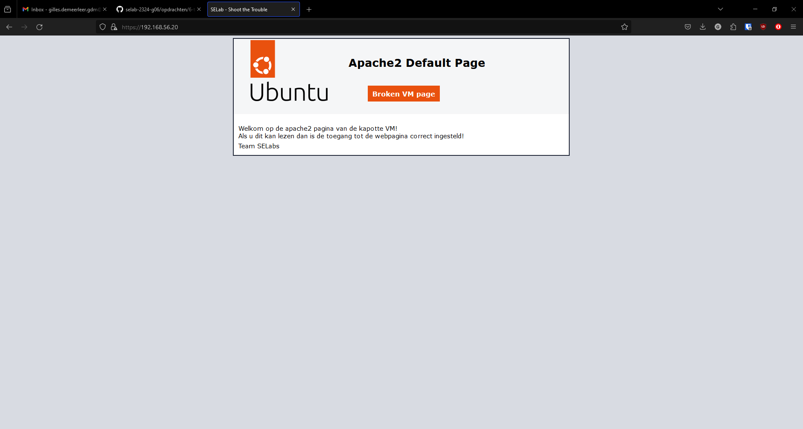
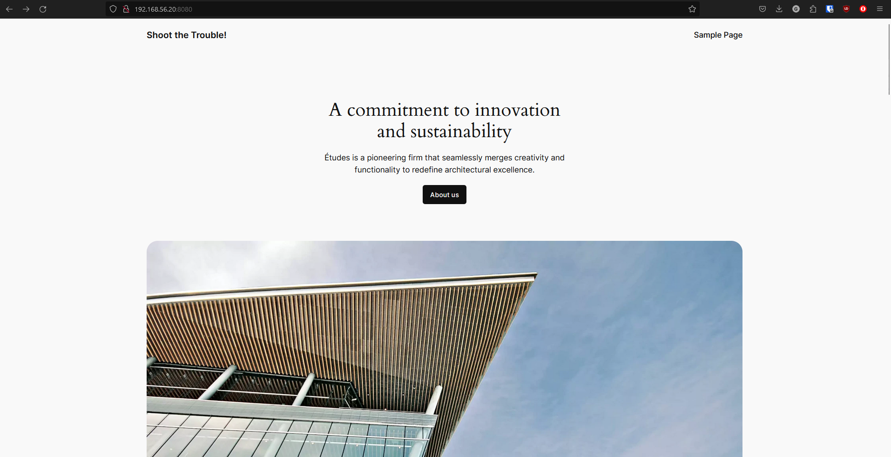
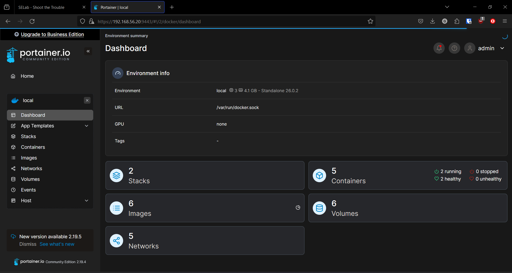
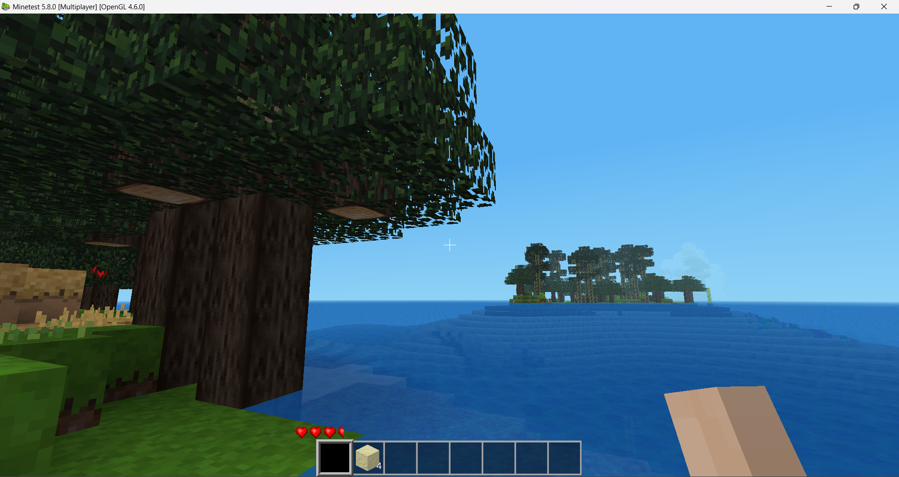
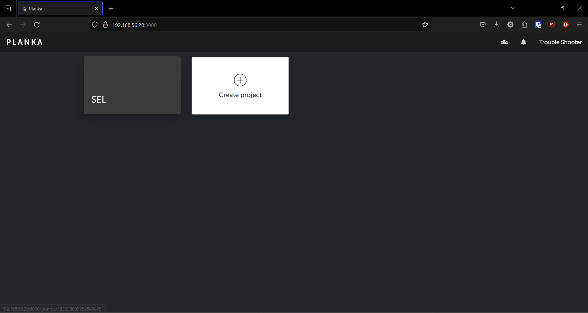

# Verslag: Troubleshooting Ubuntu VM

> Naam verslaggever: Gilles De Meerleer, Jani Aelterman, Ruben van Bruyssel en Zander Van Kerckhove

## Beschrijving

Het doel van deze opdracht was dat ieder teamlid aan de slag ging om een gesaboteerde virtuele machine te diagnosticeren en deze terug operationeel te krijgen.

## VM: 1 (Gilles De Meerleer)

Ik begon met het instellen van de host-only adapter van de VM. In VirtualBox stond dit al correct geconfigureerd vanuit het vorige labo. Nadat ik deze adapter had toegevoegd aan de kapotte VM, paste ik het configuratiebestand van de netwerkinterface aan zodat de VM wist aan welk IP-adres de host-only adapter moest worden gekoppeld. Dit deed ik door het configuratiebestand te openen in de nano-editor:

```bash
sudo nano /etc/netplan/01-network-manager-all.yaml
```

In het configuratiebestand paste ik onder enp0s8 het IP-adres aan naar 192.168.56.20:

```yaml
enp0s8:
  addresses: [192.168.56.20/24]
```

Vervolgens activeerde ik de aangepaste configuratie voor Netplan zodat deze wijzigingen ook werden doorgevoerd:

```bash
sudo netplan apply
```

Hierna lukte het om verbinding te maken via SSH met de machine.

### Apache 2

Ik controleerde of alle geïnstalleerde zaken werkten door te testen waar bepaalde zaken fout liepen. Bij het surfen naar het IP in de browser merkte ik dat de Apache-webserver niet bereikbaar was. Ik besloot de status op te vragen via de terminal en kreeg het volgende terug:

```bash
trouble@troubleshoot:~$ sudo service apache2 status
 apache2.service - The Apache HTTP Server
     Loaded: loaded (/lib/systemd/system/apache2.service; disabled; vendor preset: enabled)
     Active: inactive (dead)
       Docs: https://httpd.apache.org/docs/2.4/
```

De Apache-server draaide dus niet. Ik startte deze handmatig op:

```bash
sudo service apache2 start
```

Nadien was de webserver bereikbaar vanuit de browser.



Ik zorgde er ook nog voor dat de apache server voortaan automatisch zou opstarten bij het starten van de VM. Dit deed ik met het volgende commando

```bash
sudo systemctl enable apache2
```

### MySQL-server

Ook bij het troubleshooten van de MySQL-server begon ik met het openen van de statuspagina in de terminal:

```bash
trouble@troubleshoot:~$ sudo service mysql status
[sudo] password for trouble:
● mysql.service - MySQL Community Server
     Loaded: loaded (/lib/systemd/system/mysql.service; enabled; vendor preset: enabled)
     Active: active (running) since Thu 2024-04-25 11:58:54 UTC; 36min ago
    Process: 863 ExecStartPre=/usr/share/mysql/mysql-systemd-start pre (code=exited, status=0/SUCCESS)
   Main PID: 960 (mysqld)
     Status: "Server is operational"
      Tasks: 37 (limit: 4647)
     Memory: 427.8M
        CPU: 26.861s
     CGroup: /system.slice/mysql.service
             └─960 /usr/sbin/mysqld

Apr 25 11:58:53 troubleshoot systemd[1]: Starting MySQL Community Server...
Apr 25 11:58:54 troubleshoot systemd[1]: Started MySQL Community Server.
```

Ik kreeg terug dat de server naar behoren werkte. Hierna probeerde ik me met de verschillende accounts eens aan te melden op de server. Al snel kwam ik erachter dat de 'wpuser'-account niet bestond. Dit maakte ik dan ook meteen aan:

```sql
CREATE USER 'wpuser'@'localhost' IDENTIFIED BY 'letmein!';
```

Nadien gaf ik de gebruiker ook nog de nodige rechten.

```sql
GRANT ALL PRIVILEGES ON `wpdb`.* TO 'wpuser'@'localhost';
```

```sql
FLUSH PRIVILEGES;
```

Hierna werkte de databankserver volledig correct.

### Wordpress

Wordpress was ook niet bereikbaar op de link: http://192.168.56.20:8080
Ik controleerde eerst de tabellen in de databank wpdb, deze zagen er allemaal vrij normaal uit voor een installatie van wordpress.

```bash
mysql> SHOW TABLES FROM wpdb;
+-----------------------+
| Tables_in_wpdb        |
+-----------------------+
| wp_commentmeta        |
| wp_comments           |
| wp_links              |
| wp_options            |
| wp_postmeta           |
| wp_posts              |
| wp_term_relationships |
| wp_term_taxonomy      |
| wp_termmeta           |
| wp_terms              |
| wp_usermeta           |
| wp_users              |
+-----------------------+
12 rows in set (0.00 sec)
```

Ik keek ook na in de wp-config file of de juiste databank login was meegegeven.

```php
// ** Database settings - You can get this info from your web host ** //
/** The name of the database for WordPress */
define( 'DB_NAME', 'wpdb' );

/** Database username */
define( 'DB_USER', 'wpuser' );

/** Database password */
define( 'DB_PASSWORD', 'letmein!' );

/** Database hostname */
define( 'DB_HOST', 'localhost' );

/** Database charset to use in creating database tables. */
define( 'DB_CHARSET', 'utf8' );

/** The database collate type. Don't change this if in doubt. */
define( 'DB_COLLATE', '' );
```

Wat me wel opviel is dat de wordpress map niet in de html map van apache stond ik heb deze daar dan ook naartoe verplaatst met het mv commando. Ik paste deze wijziging ook aan in de configuratiebestanden van apache. Hierna kon ik de website al bereiken op: http://192.168.56.20:8080/


### Docker

#### Portainer

Bij het diagnosticeren van Portainer kwamen er geen errors naar boven dit werkte meteen en ik kon me aanmelden met de meegegeven inloggegevens.


#### Vaultwarden

Hierna ging ik verder met Vaultwarden, bij het uitvoeren van het commando:

```bash
docker ps -a
```

Zag ik dat de vaultwarden container niet aan het draaien was. Ik voerde het commando

```bash
docker compose up
```

uit om de container te maken en te starten. In de docker compose file merkte ik dat de paden naar de certificaten voor HTTPS niet correct waren, deze leden niet naar de twee sleutelparen die in de vaultwarden map staan, maar naar een onbestaand paar in de map opt. Daarna was het mogelijk om de vaultwarden te bereiken over https.

#### Minetest

Hier moest ik ook niets aanpassen dus dit was ook foutloos geïnstalleerd.


#### Planka

Ten slotte testte ik uit of Planka correct werkte. Dit was ook het geval, ook hier moest er niets meer aan gebeuren.


## Evaluatiecriteria

- [x] Er is een volledig werkende virtuele machine volgens de eindsituatie.
- [x] Je hebt een verslag gemaakt op basis van het template.
  - [ ] Het verslag bevat een duidelijke beschrijving van de problemen die je hebt gevonden mét de oplossingen. **Per type machine is er een aparte beschrijving!**
- [x] De cheat sheet werd aangevuld met nuttige commando's die je wenst te onthouden voor later.

## VM: 3 (Ruben Van Bruyssel)
Ik ben begonnen met het aanpassen van mijn netplan zodat het statisch werd. Dit gebeurde met wat hulp van teamgenoten om de juiste instellingen in het yaml bestand mee te geven.

```bash
sudo nano /etc/netplan/01-network-manager-all.yaml
sudo netplan apply
```

### Apache 2

Ik begon met te kijken of de service draaide en die enabled stond.

```bash
sudo systemctl status apache2
sudo systemctl reload apache2
sudo systemctl is-enabled apache2
```

Toen had ik door dat ik niet op de website kon dus had ik alle poorten gechecked.

```bash
sudo ufw status
```

Hier vond ik dat de http en de https poorten niet op allow stonden dus moesten op allow gezet worden.

```bash
sudo ufw allow 80
sudo ufw allow 443
```

Hierna kon ik op de webpagina

### MySQL-server

Ik begon met te kijken of de service aan stond en deze enabled stond.

```bash
sudo systemctl status mysql
sudo systemctl is-enabled mysql
```

Daarna logde ik in op de databank via mijn local host.

```bash
sudo mysql
```

Via de databank keek ik of alle users waren aangemaakt en zag dat de localhost MariaDB niet was aangemaakt.

```bash
SELECT User, Host
FROM mysql.user;
create user 'MariaDB'@'localhost' identified by 'letmein!';
```

## Problemen en oplossingen

Geen problemen ondervonden (buiten diegene die we moesten ondervinden).

## Voorbereiding demo

Elk groepslid start zijn machine op en toont aan dat alles werkt en geeft een korte omschrijving van de problemen die hij is tegen gekomen bij het diagnosticeren van de VM.

## Reflecties

Deze opdracht behoorde zeker tot de meer uitdagende taken die we tot nu toe voor SEL hebben gekregen. Het kost soms veel tijd en moeite om een fout op te sporen, en achteraf lijkt de oplossing vaak eenvoudig en logisch. Het geeft wel een voldaan gevoel wanneer je de service uiteindelijk succesvol kunt draaien.

## VM: 2 (Zander Van Kerckhove)

ik ben begonnen bij het aanmaken van de vm de host-only adapter in te stellen. Deze stond al correct ingesteld vanwege het feit dat we deze moesten gebruikten in vorige opdrachten.

Hierna heb ik het enp0s8 aangepast van 192.168.56.56 naar 192.168.56.20 dit heb met het volgende commando

```bash
sudo nano /etc/netplan/01-network-manager-all.yaml
```

In dit bestand heb ik het enp0s8 aangepast

```yaml
enp0s8:
  addresses: [192.168.56.20/24]
```

Achter deze aanpassingen heb ik deze toegevoegd met het volgende commando uit te voeren.

```bash
sudo netplan apply
```

Hierdoor kon ik een ssh connectie krijgen met mijn vast toestel.

### Apache 2

Toen ik de link <https://192.168.56.20> volgde merkte dat ik direct toegang had tot de apache test pagina


ik heb ook ingesteld dat de apache2 direct word opgestart samen met het toestel met het commando

```bash
sudo systemctl enable apache2
```

### MySQL-server

Bij de mySQL server heb ik een verbinding aangemaakt tussen mySQL workbench met de databank `appdb` via poort 3306 met de gebruiker `appusr` en het wachtwoord `letmein!` dit wou niet werken de volgende stap die ik heb ondernomen was kijken of de poort 3306 wel open stond dit heb ik gedaan aan de hand van dit commando:

```bash
sudo ufw status
```

hier zach ik dat de poort 3306 niet openstond, desbetreffende poort heb ik dan opengezet met het commando:

```bash
sudo ufw allow 3306
```

Hierna werkte alles correct en kon ik verbinding leggen.

### Wordpress

Bij wordpress kon ik berijken via <https://192.168.56.20:8080> toen ik keek in de config file zag ik dat de instellingen niet correct waren deze heb ik aangepast en toen kon ik wel op wordpress.

ik heb de config file bekeken en aangepast met het commando:

```bash
sudo -u www-data nano /srv/www/wordpress/wp-config.php
```

### Docker

#### Portainer

bij het diagnoseren van portainer kon ik eerst niet verbinding leggen tot ik het volgende commando uitvoerde:

```bash
docker volume create portainer_data
```

na het uitvoeren hiervan kon ik aan portainer.

#### Vaultwarden

Toen ik op de kijk op het ip <https://192.168.56.20:4123> kon ik geen verbinding krijgen toen ik keek wat dit veroorzaakte ben ik niet direct tegengekomen wat precies het probleem was en heb ik als volgende stap gekeken naar het installatie proces.
toen ik dit overliep kwam ik het op het probleem de https verbinding was niet goed ingesteld. dit heb ik gedaan met commando:

```bash
ROCKET_TLS={certs="/path/to/certs.pem",key="/path/to/key.pem"}
```

## Evaluatiecriteria

- [x] Er is een volledig werkende virtuele machine volgens de eindsituatie.
- [x] Je hebt een verslag gemaakt op basis van het template.
  - [ ] Het verslag bevat een duidelijke beschrijving van de problemen die je hebt gevonden mét de oplossingen. **Per type machine is er een aparte beschrijving!**
- [x] De cheat sheet werd aangevuld met nuttige commando's die je wenst te onthouden voor later.

## Problemen en oplossingen

Geen problemen ondervonden (buiten diegene die we moesten ondervinden).

## Voorbereiding demo

Elk groepslid start zijn machine op en toont aan dat alles werkt en geeft een korte omschrijving van de problemen die hij is tegen gekomen bij het diagnosticeren van de VM.

## Reflecties

Deze opdracht behoorde zeker tot de meer uitdagende taken die we tot nu toe voor SEL hebben gekregen. Het kost soms veel tijd en moeite om een fout op te sporen, en achteraf lijkt de oplossing vaak eenvoudig en logisch. Het geeft wel een voldaan gevoel wanneer je de service uiteindelijk succesvol kunt draaien.

## Bronnen

Glass, E., & Camisso, J. (2022, 26 april). How To Create a Self-Signed SSL Certificate for Apache in Ubuntu 22.04. DigitalOcean. https://www.digitalocean.com/community/tutorials/how-to-create-a-self-signed-ssl-certificate-for-apache-in-ubuntu-22-04

## VM: 4 (Jani Aelterman)

Ik begon met het instellen van de host-only adapter van de VM. In VirtualBox stond dit al correct geconfigureerd vanuit het vorige labo. Nadat ik deze adapter had toegevoegd aan de kapotte VM, paste ik het configuratiebestand van de netwerkinterface aan zodat de VM wist aan welk IP-adres de host-only adapter moest worden gekoppeld. Dit deed ik door het configuratiebestand te openen in de nano-editor:

```bash
sudo nano /etc/netplan/01-network-manager-all.yaml
```

In het configuratiebestand paste ik onder enp0s8 het IP-adres aan naar 192.168.56.20:

```yaml
 enp0s8:
      addresses: [192.168.56.20/24]
```

Vervolgens activeerde ik de aangepaste configuratie voor Netplan zodat deze wijzigingen ook werden doorgevoerd:

```bash
sudo netplan apply
```

Hierna lukte het om verbinding te maken via SSH met de machine.

### Apache 2

Ik begon met het te surfen naar het IP-adres van de VM in de browser. Die was perfect bereikbaar en alles werkte zoals het moest.

### Docker

#### Portainer

Eerst begon ik met te controler of de container van Portainer wel draaide. Dit deed ik door het commando `docker ps -a` uit te voeren. Hier zag ik dat de container draaide. Dan ging ik naar de webpagina van Portainer (https://192.168.56.20:9443) en probeerde in te loggen. Dit lukte zonder problemen.

#### Minetest

Hier moest ik ook niets aanpassen dus dit was ook foutloos geïnstalleerd.


#### Vaultwarden

Ik surfte naar de webpagina van Vaultwarden (https://192.168.56.20:4123) en probeerde in te loggen. Dit lukte zonder problemen.

#### Planka

Ik begon met te surfen naar de webpagina van Planka (https://192.168.56.20:3000). Dan kreeg ik een foutmelding dat er geen beveiligde verbinding tot stand kon worden gebracht, via http was de webpagina wel bereikbaar.

### Wordpress

Wordpress was bereikbaar via http://192.168.56.20:8080. Maar er kwam een database error op.
VM: 3 (Ruben Van Bruyssel)
Ik ben begonnen met het aanpassen van mijn netplan zodat het statisch werd. Dit gebeurde met wat hulp van teamgenoten om de juiste instellingen in het yaml bestand mee te geven.

### MySQL

Ik controleerde of MySQL draaide en logde dan in en keek alle gebruikers na, alle gebruikers die moesten aangemaakt worden waren aanwezig en kon inloggen als die gebruikers. De MySQL server kon niet bereikt worden via de MySQL Workbench.

### Ssh

Ik heb open-ssh-server geïnstalleerd en geconfigureerd. Ik heb poort 22 opengezet in de firewall en de ssh service opgestart en het werkte zoals het moest.
