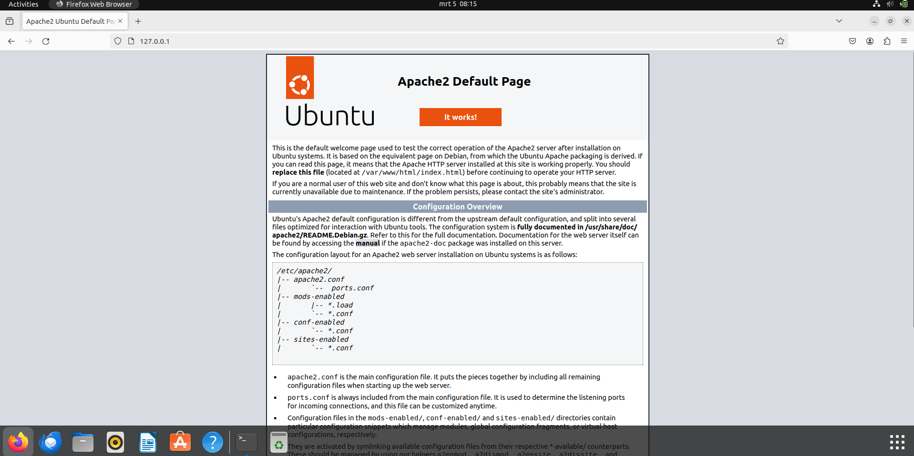

# Verslag: Opdracht 3 webserver opzetten

> Naam verslaggever: Gilles De Meerleer

## Beschrijving

De bedoeling van deze opdracht was om een eigen webserver (Apache) op te zetten op onze virtuele machine. We zorgden ervoor dat we deze via HTTPS konden bereiken. Vervolgens stelden we ook een firewall in op onze Ubuntu-machine om deze beter te beveiligen tegen cyberaanvallen. We maakten ook gebruik van Fail2ban om bruteforce-aanvallen te beperken door slechts een aantal pogingen per IP toe te laten.
## Antwoorden op de vragen in de opdracht

### Vraag 1 - Luistert de Apache netwerkservice enkel naar de loopback-interface zoals MySQL? Of is de service meteen ook van buitenaf toegankelijk? Hoe controleer je dit?
De service is van buitenaf toegankelijk, we kunnen dit zien door het commando: 
```console
 sudo ss -tlnp
 ```
 We krijgen dan de volgende uitvoer:
 ``` 
 State         Recv-Q        Send-Q               Local Address:Port                Peer Address:Port       Process                                                                                                    

LISTEN        0             128                      127.0.0.1:631                      0.0.0.0:*           users:(("cupsd",pid=646,fd=7))                                                                            

LISTEN        0             4096                 127.0.0.53%lo:53                       0.0.0.0:*           users:(("systemd-resolve",pid=402,fd=14))                                                                 

LISTEN        0             151                        0.0.0.0:3306                     0.0.0.0:*           users:(("mysqld",pid=710,fd=23))                                                                          

LISTEN        0             70                       127.0.0.1:33060                    0.0.0.0:*           users:(("mysqld",pid=710,fd=21))                                                                          

LISTEN        0             511                              *:80                             *:*           users:(("apache2",pid=5069,fd=4),("apache2",pid=5068,fd=4),("apache2",pid=5067,fd=4))                     

LISTEN        0             128                          [::1]:631                         [::]:*           users:(("cupsd",pid=646,fd=6))  
 ```
Op de voorlaatste lijn staat apache die luisterd naar poort 80.
### Vraag 2 - Zal de Apache service opstarten (= "enabled") bij booten van de VM? Hoe controleer je dit?
Deze zal opstarten bij het booten van de VM. Je kan dit controleren door het volgende commando te gebruiken:
```
sudo systemctl is-enabled apache2
```
We krijgen dan terug dat deze op enabled staat.
### Default Apache pagina
Als we naar 127.0.0.1 surfen dan krijgen we nu de standaard apache webserver pagina te zien. Op de eigen laptop krijgen we de pagina te zien op het host-only IP: http://192.168.56.20/

### Vraag 3 - Wat is het pad naar de Document Root?
Het pad naar de document root is:
```
/var/www/html/
```
### Vraag 4 - Met welke twee commando's kan je controleren of de SSH server draait, en op welke poort?
Dit draait op poort: 22
```
sudo systemctl status ssh
sudo ss -tlnp 
```
### Vraag 5 - Welke netwerkpoort wordt gebruikt voor HTTPS? Met welk commando kan je dit opzoeken?
De netwerkpoort die gebruikt wordt voor HTTPS is 443, we zien dit met het commando
    sudo ss -tlnp
### Vraag 6 - Bepaal welke netwerkpoorten gebruikt worden voor resp. SSH, HTTP, HTTPS en MySQL.
    sudo ss -tlnp
    SSH: Poort 22
    HTTP: Poort 80
    HTTPS: Poort 443
    MySQL: Poort 3306
### Vraag 7 -Zoek op hoe je via het commando **ufw** de firewall kan activeren en activeer deze.
    sudo ufw enable
### Vraag 8 - Zorg ervoor dat het verkeer op de poorten uit stap 1 door de firewall toegelaten wordt.
    sudo ufw allow 22/tcp
    sudo ufw allow 80/tcp
    sudo ufw allow 443/tcp
    sudo ufw allow 3306/tcp
### Vraag 9 - Test of alle netwerkdiensten nog bereikbaar zijn vanop je fysieke systeem.
    ssh gilles@192.168.56.20
  Naar IP surfen in browser om te zien of deze nog inlaad.

### Vraag 10 - Gebruik systemctl om fail2ban op te starten bij het starten van de VM. Hoe kan je opzoeken of dit correct gebeurd is?
```
sudo systemctl status fail2ban
```
### Vraag 11 - Configureer fail2ban zodat het een IP-adres blokkeert bij 6 foutieve aanmeldpogingen via SSH, binnen een tijdspanne van 3 minuten. Het IP-adres wordt dan voor 15 minuten geblokkeerd.
```
[sshd]
port    = ssh
logpath = %(sshd_log)s
backend = %(sshd_backend)s
findtime = 180
maxretry = 6
bantime = 900
```
### Vraag 12 - Log nu terug uit en probeer meermaals in te loggen met een fout wachtwoord.
  - Hoe ervaar je dit?
  Het lukt niet langer om te proberen een verbinding op te zetten met de server.
  - Geeft SSH je nog iets van toelichting? ssh_dispatch_run_fatal: Connection to 192.168.56.20 port 22: Connection timed out.
  In de VM komt het IP in de lijst met geblokkeerde IP-adressen.
  ```
  gilles@gilles-VirtualBox:~$ sudo fail2ban-client status sshd

Status for the jail: sshd

|- Filter

|  |- Currently failed:	0

|  |- Total failed:	8

|  `- File list:	/var/log/auth.log

`- Actions

   |- Currently banned:	1

   |- Total banned:	1

   `- Banned IP list:	192.168.56.1
  ```
### Vraag 13 -  Zoek op hoe je de fail2ban command line client kan gebruiken om de volgende vragen te beantwoorden:
- Hoe kan je zien welke jails geconfigureerd zijn?
```
sudo fail2ban-client status
```
- Hoe kan je zien welke IP-adressen geblokkeerd zijn?
```
sudo fail2ban-client status sshd
```
 - Hoe kan je de **findtime**, **maxretry** en **bantime** opvragen van de **sshd** jail?
 ```
sudo fail2ban-client get sshd findtime
sudo fail2ban-client get sshd maxretry
sudo fail2ban-client get sshd bantime
```
 - Hoe kan je jouw IP-adres terug vrijmaken zonder te wachten tot de blokkeertijd verlopen is?
 ```
 sudo fail2ban-client set sshd unbanip [IP-adres]
```
### Vraag 14 - Zoek op in de documentatie van fail2ban hoe je een IP-adres kan whitelisten, en doe dit voor het adres 192.168.56.30. Herstart daarna fail2ban.
 ```
sudo fail2ban-client set sshd addignoreip 192.168.56.30
sudo systemctl restart fail2ban
```
## Extra's
### Hydra
Als extra besloten we om Hydra te installeren op een andere VM met een IP die niet in de whitelist staat, hiermee kunnen we een lijst wachwoorden gebruiken om te proberen inloggen met SSH.
```
hydra -l gilles -P ./Downloads/wordlist.txt 192.168.56.20 ssh
```
Wanneer we dit commando uitvoeren probeert hydra met alle wachtwoorden uit de lijst die we toegevoegd hebben aan te melden over ssh. Doordat we in fail2ban hebben ingesteld dat elk IP een maximum van 6 pogingen heeft kan hydra hier niet op aanmelden. Hierdoor krijgen we een error, die meld dat we niet meer kunnen aanmelden.
```
┌──(kali㉿kali)-[~]
└─$ hydra -l gilles -P ./Downloads/wordlist.txt  192.168.56.20 ssh
Hydra v9.5 (c) 2023 by van Hauser/THC & David Maciejak - Please do not use in military or secret service organizations, or for illegal purposes (this is non-binding, these *** ignore laws and ethics anyway).

Hydra (https://github.com/vanhauser-thc/thc-hydra) starting at 2024-03-10 05:31:53
[WARNING] Many SSH configurations limit the number of parallel tasks, it is recommended to reduce the tasks: use -t 4
[DATA] max 16 tasks per 1 server, overall 16 tasks, 1049938 login tries (l:1/p:1049938), ~65622 tries per task
[DATA] attacking ssh://192.168.56.20:22/
[STATUS] 42.00 tries/min, 42 tries in 00:01h, 1049906 to do in 416:38h, 6 active
[ERROR] all children were disabled due too many connection errors
0 of 1 target completed, 0 valid password found
[INFO] Writing restore file because 2 server scans could not be completed
[ERROR] 1 target was disabled because of too many errors
[ERROR] 1 targets did not complete
Hydra (https://github.com/vanhauser-thc/thc-hydra) finished at 2024-03-10 05:33:21

```
## Evaluatiecriteria

- [x] Je kan de VM opstarten.
- [x] Je kan met FileZilla (of een gelijkaardige applicatie) bestanden naar de Document Root van de webserver kopiëren.
- [x] De website is te zien in een webbrowser op het fysieke systeem via URL <https://192.168.56.20>.
- [X] Je kan aantonen dat de firewall actief is en dat de juiste poorten toegelaten zijn in de firewall:
  - [X] Je kan aantonen dat je nog steeds kan verbinden via SSH of SFTP.
  - [X] Je kan aantonen dat de MySQL Workbench nog steeds kan verbinden met de VM.
  - [X] Je kan aantonen dat je website nog steeds bereikbaar is.
- [X] Je kan aantonen dat fail2ban actief is.
- [X] Je kan de inhoud van het **jail.local** bestand tonen en toelichten.
- [X] Je kan met de **fail2ban** command line client aantonen dat de **findtime**, **maxretry** en **bantime** juist zijn ingesteld. Je kan deze begrippen toelichten.
- [X] Je kan aantonen dat je via SSH kan inloggen op de VM vanop jouw fysiek toestel en dat fail2ban jouw IP-adres blokkeert als je te veel foutieve inlogpogingen doet.
- [X] Je kan aantonen dat een IP-adres op de whitelist niet wordt geblokkeerd.
- [X] Je hebt een verslag gemaakt op basis van het template.
- [X] De cheat sheet werd aangevuld met nuttige commando's die je wenst te onthouden voor later.


## Problemen en oplossingen

Geen problemen ondervonden


## Voorbereiding demo

-  Je kan de VM opstarten.
- VM in VirtualBox aanzetten
- Je kan met FileZilla (of een gelijkaardige applicatie) bestanden naar de Document Root van de webserver kopiëren.
- Connectie maken met filezilla en een bestand kopiëren
-  De website is te zien in een webbrowser op het fysieke systeem via URL <https://192.168.56.20>.
- surfen naar de url
-  Je kan aantonen dat de firewall actief is en dat de juiste poorten toegelaten zijn in de firewall:
-   ``` sudo ufw status ```
  -  Je kan aantonen dat je nog steeds kan verbinden via SSH of SFTP.
 - ```ssh gilles@192.168.56.20 ```
  -  Je kan aantonen dat de MySQL Workbench nog steeds kan verbinden met de VM.
  - Workbech openen en verbinden met de databankserver
  -  Je kan aantonen dat je website nog steeds bereikbaar is.
  - Naar websute surfen
- Je kan aantonen dat fail2ban actief is.
- ```sudo systemctl status fail2ban```
-  Je kan de inhoud van het **jail.local** bestand tonen en toelichten.
- ```cat /etc/fail2ban/jail.local```
- Je kan met de **fail2ban** command line client aantonen dat de **findtime**, **maxretry** en **bantime** juist zijn ingesteld. Je kan deze begrippen toelichten.
```
sudo fail2ban-client get sshd findtime
sudo fail2ban-client get sshd maxretry
sudo fail2ban-client get sshd bantime
 ```
- Je kan aantonen dat je via SSH kan inloggen op de VM vanop jouw fysiek toestel en dat fail2ban jouw IP-adres blokkeert als je te veel foutieve inlogpogingen doet.
 ```
 ssh gilles@192.168.56.20
  ```
- Je kan aantonen dat een IP-adres op de whitelist niet wordt geblokkeerd.
```
  sudo fail2ban-client set sshd addignoreip <whitelisted_IP>
 ```
## Reflecties

De opdracht was wederom goed te doen, de opgave was duidelijk geformuleerd en alles was redelijk snel te vinden.

## Bronnen

Banerjee, D. (2023, 27 april). How to use Hydra to Brute-Force SSH Connections? - LinuxForDevices. LinuxForDevices. https://www.linuxfordevices.com/tutorials/linux/hydra-brute-force-ssh
