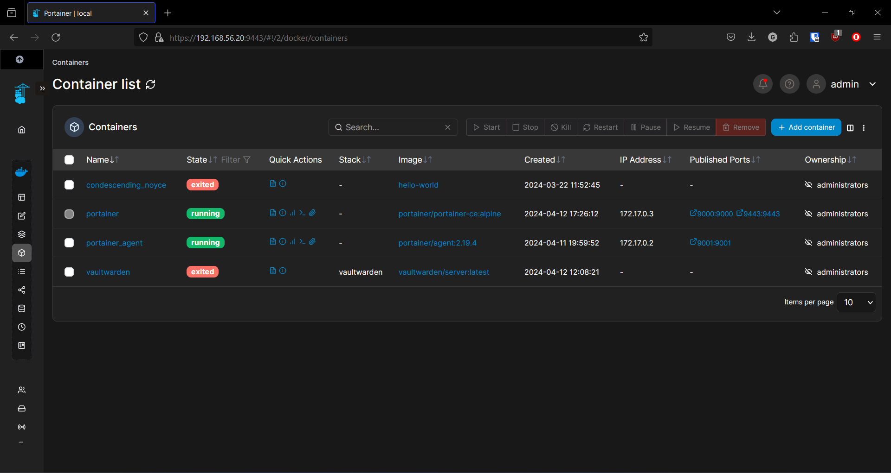
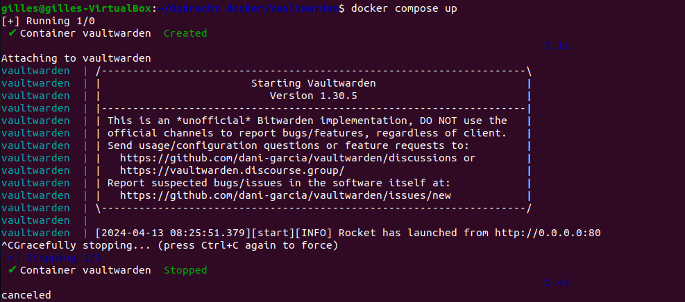

# Verslag: Docker

> Naam verslaggever: Gilles De Meerleer

## Beschrijving

Het doel van deze opdracht was om verder kennis te maken met docker door een portainer dashboard en een vaultwarden password manager te installeren in docker containers op onze ubuntu machine.

## Antwoorden op de vragen in de opdracht

### Vraag 1 - Wat is `${USER}`?

`${USER}` is een shell-variabele die de huidige gebruikersnaam van de gebruiker vertegenwoordigt die is ingelogd op het systeem. Wanneer je deze variabele gebruikt in een shell-commando, wordt deze vervangen door de werkelijke gebruikersnaam van de gebruiker.

### Vraag 2 - Welk commando kan je gebruiken om jouw gebruikersnaam te bepalen?

Je kan dit bepalen met het commando:

```shell
whoami
```

Dit geeft dan gewoon de naam van de user terug.

### Vraag 3 - Welke commando's gebruik je hiervoor?

Eerst updaten we alle packages op ons systeem met:

```shell
sudo apt update
sudo apt upgrade
```

Nadien maken we een map aan voor vaultwarden en halen we de docker-compose file op van github

```shell
sudo apt install docker-compose

mkdir ~/.files-vaultwarden

curl -LJO https://github.com/dani-garcia/vaultwarden/raw/main/docker/docker-compose.yml

docker-compose up -d

docker pull vaultwarden/server:latest
docker run -d --name vaultwarden -v /vw-data/:/data/ --restart unless-stopped -p 80:80 vaultwarden/server:latest
```

### Vraag 4 - Wat doet het docker pull commando?

Het docker pull commando haalt een docker image op van Docker Hub of een andere online locatie.

### Vraag 5 - Hoe kan je alle lokale images bekijken?

Lokale images kunnen worden bekenen door het commando:

```shell
docker images
```

### Vraag 6 - Hoe bekijk je alle lokaal draaiende containers?

Je kan de lokaal draaiende containers bekijken met het commando:

```shell
docker ps
```

### Vraag 7 - Hoe bekijk je alle lokale containers (inclusief de gestopte containers)?

Je kan de lokaal draaiende containers bekijken met hetzelfde commando als in vraag 6, je moet er enkel de optie -a aan toevoegen:

```shell
docker ps -a
```

### Vraag 8 - Waarom heeft Vaultwarden HTTPS nodig?

Vaultwarden heeft HTTPS nodig omdat het niet verstandig is om wachtwoorden plain text over het netwerk van de server naar de client te verzenden. Het zou dan nog veiliger zijn om de wachtwoorden op een post-it te schrijven en ze op de pc zelf te kleven.

### Vraag 9 - Installatie portainer, Welke commando's gebruik je hiervoor?

Voor de installatie van portainer gebruiken we de volgende commando's

```shell
docker volume create portainer_data
docker run -d -p 8000:8000 -p 9443:9443 --name portainer --restart=always -v /var/run/docker.sock:/var/run/docker.sock -v portainer_data:/data portainer/portainer-ce:latest
```

### Vraag 10 - Hoe stellen we in dat docker gebruik maakt van een docker volume?

```shell
docker run -d \
  -p 9000:9000 \
  --name portainer \
  --mount type=bind,source=~/portainer_data,target=/data \
  portainer/portainer
```

### Vraag 11 - Wat is het verschil tussen een Docker volume (= volume) en een map op jouw VM gemount als volume (= bind mount)?

Een docker volume is een opslaglocatie die speciefiek voor docker toepassingen is ontwikkeld. Het is mogelijk om extra functionaliteiten toe te voegen aan deze volumes zoals bijvoorbeeld het nemen van eenvoudige backups of het kunnen delen van zaken tussen verschillende containers.

Bind mount is een directe koppeling naar een map op het hostbestandssysteem. Docker gebruikt deze map en maakt er een volume in dat door de docker applicatie gebruikt wordt.

### Vraag 12 - Kun je de containers zien in portainer?



### Vraag 13 - Kun je vaultwarden afsluiten en terug opstarten via portainer?


### Vraag 14 - Waarvoor staat de optie - d in docker compose up?

Dit staat voor detached mode, hiermee wordt de container opgestart zonder dat de uitvoer naar de terminal wordt gestreamed. Dit is handig omdat anders de terminal vast zou zitten op de uitvoer van docker


### Vraag 15 - Hoe kan je een docker commando omvormen naar een docker compose commando?

```yml
version: "3"

services:
  portainer:
    image: portainer/portainer
    ports:
      - "9000:9000"
    volumes:
      - /var/run/docker.sock:/var/run/docker.sock
```

### Vraag 16 - Is het samenvoegen van containers in een docker compose file een goed idee

Ikzelf vind dit niet zo'n goed idee, omdat het het beheren onnodig complex maakt en niet zo overzichtelijk is als elke container in een apart bestand te plaatsen.

### Vraag 17 - Hoe verwijder je eenvoudig alle containers uit jouw docker-compose.yml bestand zonder gebruik te maken van docker stop en docker rm?

Je kunt alle containers die worden beheerd door een specifiek docker-compose.yml-bestand verwijderen met het volgende commando:

```shell
docker-compose down
```

### Vraag 18 - Hoe kan je met één commando alle containers, images, networks en volumes verwijderen die niet meer in gebruik zijn?

Je kunt alle niet-gebruikte containers, images, networks en volumes verwijderen met behulp van het volgende docker-commando:

```shell
docker system prune --all --volumes
```

### Vraag 19 - Je zal in de documentatie unused images en dangling images tegenkomen. Wat is het verschil tussen beide?

- Unused images, dit zijn zoals de naam al doet vermoeden images die niet of niet langer gebruikt worden door een draaiende container. Deze kunnen overblijven nadat een container is verwijderd.

- Dangling images, dit zijn oudere versies van images die ontstaan wanneer er een update geïnstalleerd wordt en de oude versie niet expliciet wordt getagd met een label (zoals een versienummer of een specifieke tag). Deze oudere versies blijven achter als ongebruikte resources in het Docker-systeem, omdat er geen actieve containers zijn die naar hen verwijzen en ze niet zijn getagd voor gebruik.

## Evaluatiecriteria

- [x] De `docker-compose.yml` bestanden zijn te vinden op de GitHub repository van de groep.
- [x] Je kan alle instructies van Docker en Docker compose uitvoeren zonder `sudo` te gebruiken.
- [x] Je hebt Docker geïnstalleerd en kan dit aantonen met `docker --version`.
- [x] Je hebt Docker Compose geïnstalleerd en kan dit aantonen met `docker compose version`.
- [x] Je kan de command line instructies om een Vaultwarden container op te zetten toelichten.
- [x] Je kan de command line instructies om een Portainer container op te zetten toelichten.
- [x] Je kan een Vaultwarden container opzetten via Docker Compose op de command line. Je kan surfen via HTTPS naar en inloggen op deze container op het fysieke systeem (bv. via <https://192.168.56.20>).
  - [x] Je hebt deze ook gekoppeld aan een web browser client op het fysieke systeem.
- [x] Je kan een Portainer container opzetten via Docker Compose op de command line. Je kan surfen naar en inloggen op deze container op het fysieke systeem (bv. via <http://192.168.56.20>). Portainer en Vaultwarden worden op het Portainer dashboard weergegeven met als status "Running".
- [x] Je hebt een verslag gemaakt op basis van het template.
- [x] De cheat sheet werd aangevuld met nuttige commando's die je wenst te onthouden.

## Problemen en oplossingen

Ruben : Virtuele machine is corrupted dus moest een nieuwe aanmaken hierdoor heb ik problemen met het openen van de docker.

## Voorbereiding demo

- Je kan alle instructies van Docker en Docker compose uitvoeren zonder `sudo` te gebruiken.

```shell
docker ps -a
```

- Je hebt Docker geïnstalleerd en kan dit aantonen met `docker --version`.
- Je hebt Docker Compose geïnstalleerd en kan dit aantonen met `docker compose version`.
- Je kan de command line instructies om een Vaultwarden container op te zetten toelichten.

```shell
docker pull vaultwarden/server:latest
docker run -d --name vaultwarden -v /vw-data/:/data/ --restart unless-stopped -p 80:80 vaultwarden/server:latest
```

- Je kan de command line instructies om een Portainer container op te zetten toelichten.

```shell
docker volume create portainer_data
docker run -d -p 8000:8000 -p 9443:9443 --name portainer --restart=always -v /var/run/docker.sock:/var/run/docker.sock -v portainer_data:/data portainer/portainer-ce:latest
```

- Je kan een Vaultwarden container opzetten via Docker Compose op de command line. Je kan surfen via HTTPS naar en inloggen op deze container op het fysieke systeem (bv. via <https://192.168.56.20>).
  Aanmelden op vaultwarden via fysiek systeem.
- Je hebt deze ook gekoppeld aan een web browser client op het fysieke systeem.
  Aanmelden via bitwarden client
- Je kan een Portainer container opzetten via Docker Compose op de command line. Je kan surfen naar en inloggen op deze container op het fysieke systeem (bv. via <http://192.168.56.20>). Portainer en Vaultwarden worden op het Portainer dashboard weergegeven met als status "Running".
  Portainer openen op: <https://192.168.56.20:9443/#!/2/docker/containers>

## Reflecties

Het moeilijkste aan deze opdracht vond ik de self signed https voor vaultwarden, voor portainer werd deze automatisch in orde gebracht, maar de vaultwarden image gaf hier steeds problemen op. Voor de rest verliep de opdracht vrij vlot.

## Bronnen

Borisov, B. (2023, 30 juli). How to Install Vaultwarden Password Manager with Docker. Linuxiac. https://linuxiac.com/how-to-install-vaultwarden-password-manager-with-docker/

Portainer.io. (2023, 12 juli). Kubernetes and Docker Container Management Software. https://www.portainer.io/

Installing Vaultwarden (Bitwarden compatible) Server with Docker. (z.d.). community.netcup. https://community.netcup.com/en/tutorials/vaultwarden
